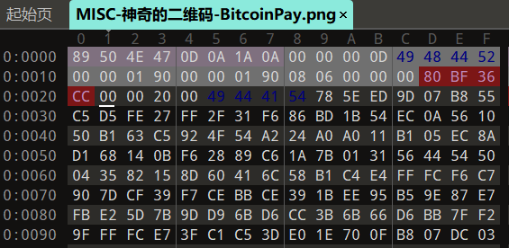

一个PNG图片的格式如下

PNG图片固定以 89 50 4E 47 0D 0A 1A 0A （4个字节）开头

接下来是IHDR区，这个区标识着PNG文件的属性参数，如长宽、色彩模式等，具体如下：

08-0B：4个字节标识IHDR区的大小（注意是去掉tag和crc32后的大小），这里为00 00 00 0D，即13个字节。

0C-0F：4个字节，固定为49 48 44 52(IHDR) 标识该区为IHDR区
10-13：4个字节，图片宽度，此处为0x190=3040像素
14-17：4个字节，图片高度，此处为0x190=3040像素
18：1个字节 图像深度，此处为8
19：1个字节 颜色类型，此处为6
1A：1个字节 压缩算法，此处为0（无压缩）
1B：1个字节 滤波方法，此处为0（自适应滤波）
1C：1个字节 隔行扫描，此处为0（非隔行扫描）

1D-20：4个字节，crc32校验值，此处为 0x80BF36CC

利用PNG图片进行隐写时，有种方法是修改图片大小，如将图片的大小由2048×1200修改为2048×900，隐藏的300像素宽度里隐写了重要信息。

修改图片大小时，往往不会修改CRC32校验值，因此我们可以通过CRC32值，还原出图片的原始大小。

2160015052
400 400
hex: 0x190 0x190